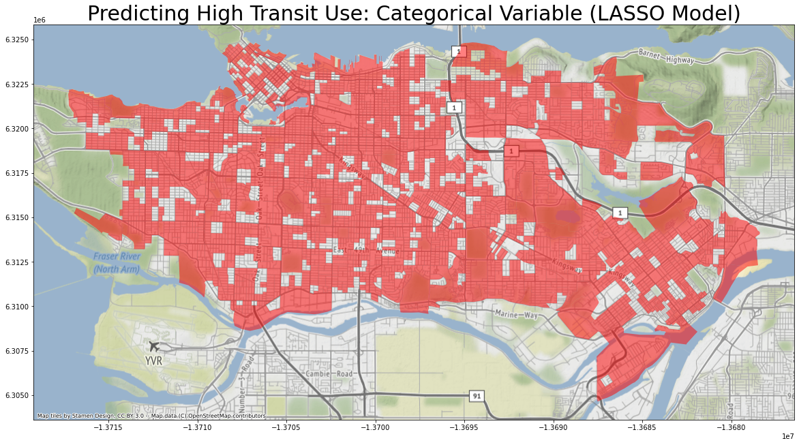
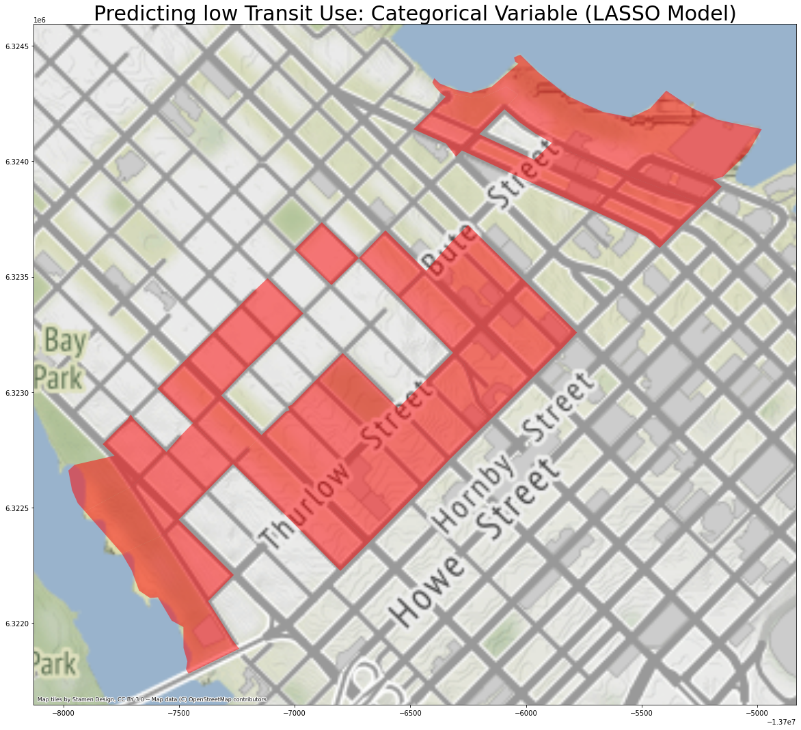
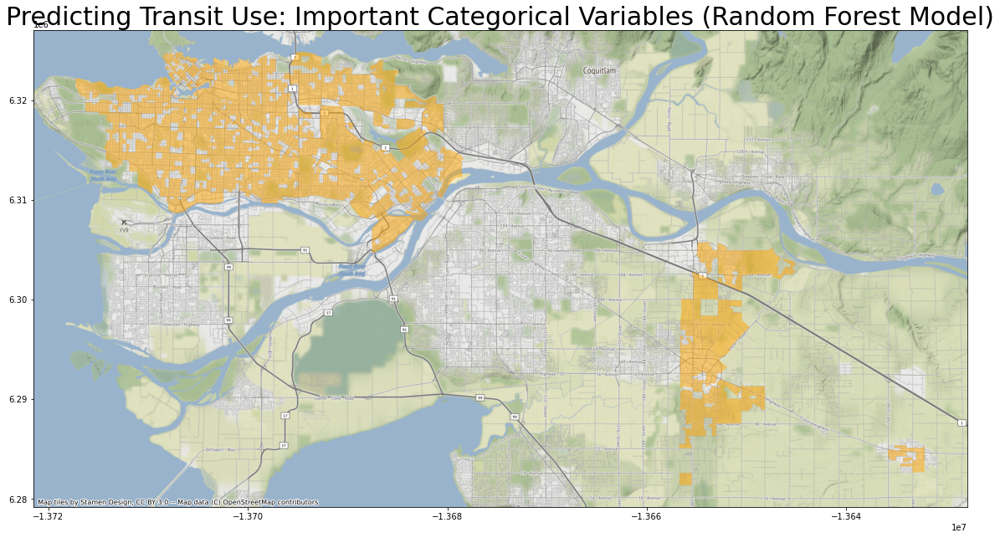
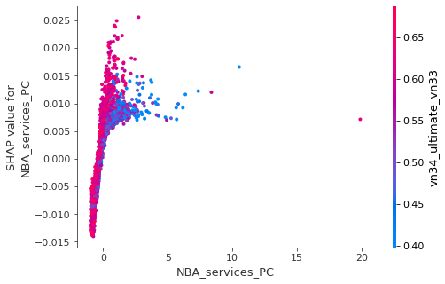
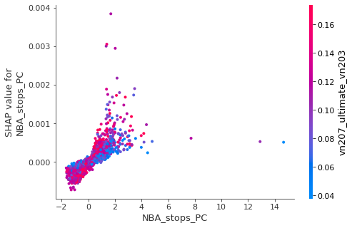
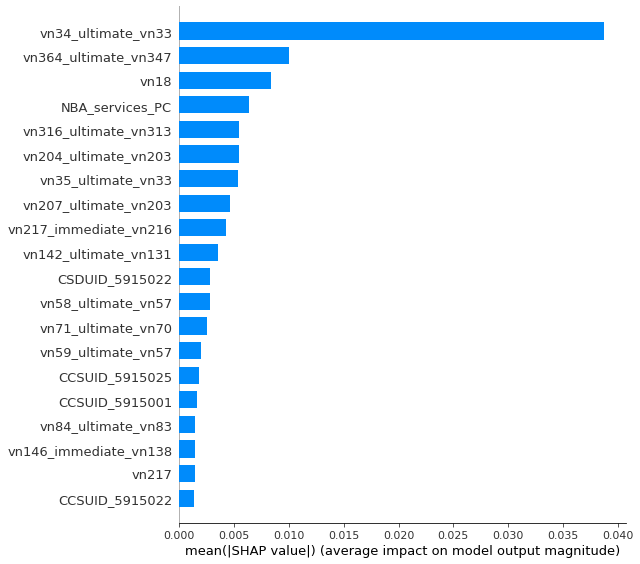
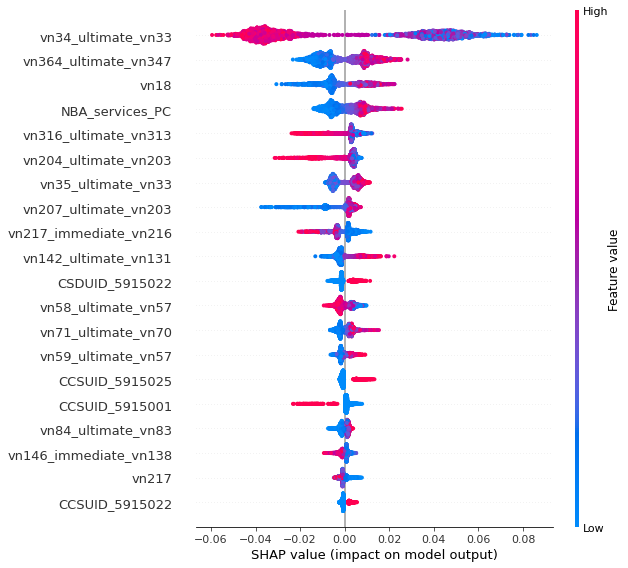
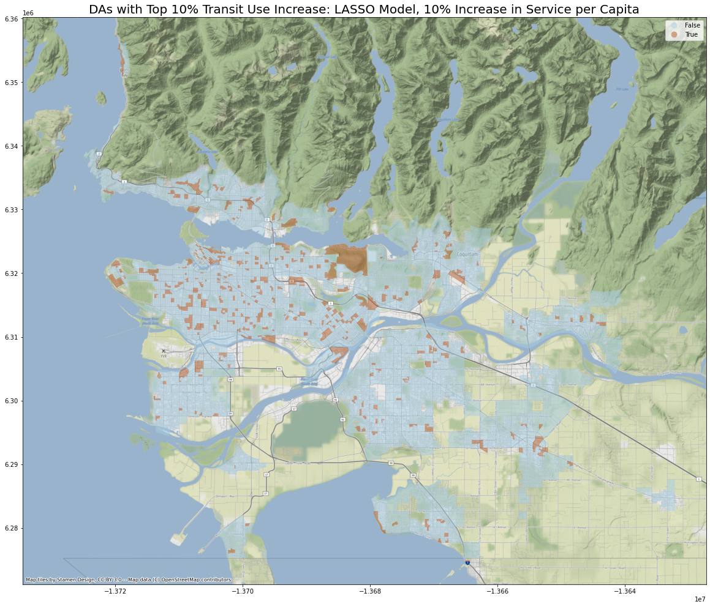
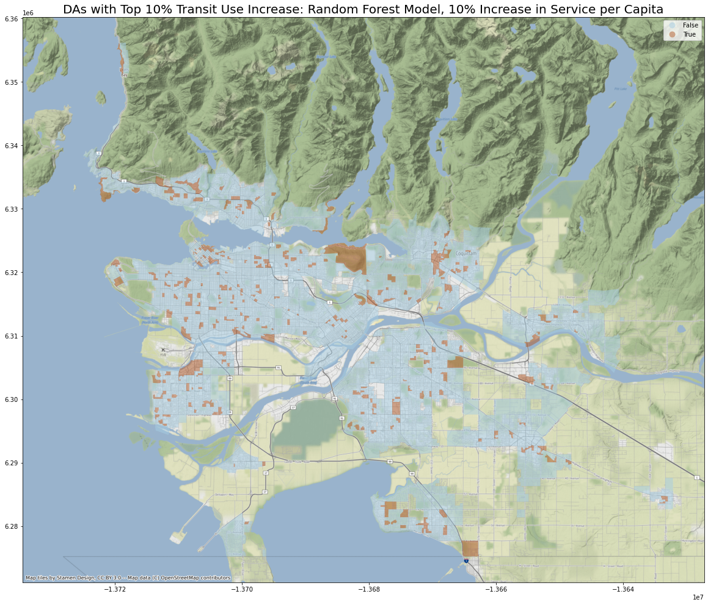

# Model Analyses and Interpretation

So far, I have trained two machined learning models to explain the impact of access to transit on the proportion of residents using public transportation, down to the DA level. I also tuned their hyperparameters using cross validation. They have both achieved cross-validation $R^2$ at about 0.67. 

However, there is still a big distance between our models and actionable real-world solutions. At the end of the day, we want to know where the transit authority of Greater Vancouver Area should put resource to develop new infrastructure. 


```python
import altair as alt
import geopandas
import json
import joblib
import os
import numpy as np
import pandas as pd
import shap
```


```python
# sklearn modules
from sklearn.compose import ColumnTransformer
from sklearn.ensemble import RandomForestRegressor
from sklearn.impute import SimpleImputer
from sklearn.linear_model import Lasso
from sklearn.pipeline import Pipeline
from sklearn.preprocessing import (
    OneHotEncoder,
    OrdinalEncoder,
    StandardScaler,
    MinMaxScaler,
)
```


```python
# Mapping modules
import contextily as ctx
import matplotlib.pyplot as plt

GVA_map_xlim_lower = -13746072.435927173
GVA_map_xlim_higher = -13630000
GVA_map_ylim_lower = 6270302.809935683
GVA_map_ylim_higher = 6345000
```


```python
# Re-define working directory
data_version = "20200606"
cwd = os.path.dirname(os.getcwd())
os.chdir(cwd)
cwd = os.path.dirname(os.getcwd())
os.chdir(cwd)
data_dir = os.path.join(os.getcwd(), "TL_data", data_version)
```


```python
## Data
X_train = geopandas.read_file(
    os.path.join(os.getcwd(), "Data_Tables", data_version, "X_train.json")
)
```


```python
with open(os.path.join(os.getcwd(), "Data_Tables", data_version, "X_header.json"), "r") as X_header_outfile:
    X_header = json.load(X_header_outfile)
    
with open(os.path.join(os.getcwd(), "Data_Tables", data_version, "y_train.json"), "r") as y_train_outfile:
    y_train = json.load(y_train_outfile)
y_train = pd.read_json(y_train, typ="series")
```


```python
# Read data and models

## Trained models
random_search_rf = joblib.load(os.path.join(
        os.getcwd(),
        "Models",
        data_version,
        "random_search_rf.joblib",
    ))
random_search_LASSO = joblib.load(os.path.join(
        os.getcwd(),
        "Models",
        data_version,
        "random_search_LASSO.joblib",
    ))
```


```python
## Pre-processor 
preprocessor, categorical_transformer, numeric_transformer, proportion_transformer, ColumnTransformer = joblib.load(
    os.path.join(os.getcwd(), "Models", data_version, "preprocessor.joblib")
)


## Variable types
with open(
    os.path.join(os.getcwd(), "Models", data_version, "features.json"),
    "r",
) as feature_outfile:
    categorical_features, numeric_features, proportion_features, geometry_feature = json.load(feature_outfile)

## LASSO model
pipe_LASSO = Pipeline(
    steps=[
        ("preprocessor", preprocessor),
        ("LASSO_reg", Lasso()),
    ]
)
## Random Forest model
pipe_rf = Pipeline(
    steps=[
        ("preprocessor", preprocessor),
        ("rf_reg", RandomForestRegressor()),
    ]
)
```


```python
## Get input feature names
def get_column_names_from_ColumnTransformer(column_transformer):

    col_name = []

    for transformer_in_columns in column_transformer.transformers_[
        :-1
    ]:  # the last transformer is ColumnTransformer's 'remainder'
        print("\n\ntransformer: ", transformer_in_columns[0])

        raw_col_name = list(transformer_in_columns[2])

        if isinstance(transformer_in_columns[1], Pipeline):
            # if pipeline, get the last transformer
            transformer = transformer_in_columns[1].steps[-1][1]
        else:
            transformer = transformer_in_columns[1]

        try:
            if isinstance(transformer, OneHotEncoder):
                names = list(transformer.get_feature_names(raw_col_name))

            elif isinstance(transformer, SimpleImputer) and transformer.add_indicator:
                missing_indicator_indices = transformer.indicator_.features_
                missing_indicators = [
                    raw_col_name[idx] + "_missing_flag"
                    for idx in missing_indicator_indices
                ]

                names = raw_col_name + missing_indicators

            else:
                names = list(transformer.get_feature_names())

        except AttributeError as error:
            names = raw_col_name

        col_name.extend(names)

    return col_name


preprocessor.fit(X_train)
feature_names = get_column_names_from_ColumnTransformer(preprocessor)

categorical_feature_names = list(preprocessor.named_transformers_["cat"]["onehot"].get_feature_names(categorical_features))
numeric_feature_names = numeric_features
proportion_feature_names = proportion_features
```

    
    
    transformer:  cat
    
    
    transformer:  num
    
    
    transformer:  prop


```python
preprocessor.named_transformers_["cat"]["onehot"]
```


    OneHotEncoder(handle_unknown='ignore')


## Feature Importance
Both LASSO and Random Forest models give easy access to measurements of global feature importances. 
For LASSO model, I use the magnificance of coefficients to roughly estimate each variable's importance. 
For Random Forest model, I use the [impurity measurement](https://scikit-learn.org/stable/modules/generated/sklearn.ensemble.RandomForestClassifier.html#sklearn.ensemble.RandomForestClassifier.feature_importances_) of each variable's importance. 

In addition, the three types of input variables, namely `categorical_features`, `numeric_features`, and `proportion_features` are scaled differently in the `preprocessing` step. Therefore, I will review the important variables for all three categories separately. 


```python
### LASSO Model
LASSO_coeffs = random_search_LASSO.best_estimator_["LASSO_reg"].coef_

LASSO_feature_coeffs = pd.DataFrame({"feature": feature_names, "coeffs": LASSO_coeffs})
### Random Forest Model
rf_immpurity_feat_imp = random_search_rf.best_estimator_["rf_reg"].feature_importances_

rf_immpurity_feat_imp_coeffs = pd.DataFrame(
    {"feature": feature_names, "impurity_importance": rf_immpurity_feat_imp}
)
```

### Categorical features

#### LASSO Model
The table below shows the five categorical features that mostly strongly predict proportion of transit use among residents. They are ADA or CCS areas. 


```python
#### Categorical features
LASSO_categorical_feature_coeffs = LASSO_feature_coeffs.loc[LASSO_feature_coeffs["feature"].isin(categorical_feature_names), :]
LASSO_categorical_feature_coeffs.sort_values("coeffs", ascending = False).head(5)
```


<div>
<style scoped>
    .dataframe tbody tr th:only-of-type {
        vertical-align: middle;
    }

    .dataframe tbody tr th {
        vertical-align: top;
    }

    .dataframe thead th {
        text-align: right;
    }
</style>
<table border="1" class="dataframe">
  <thead>
    <tr style="text-align: right;">
      <th></th>
      <th>feature</th>
      <th>coeffs</th>
    </tr>
  </thead>
  <tbody>
    <tr>
      <th>148</th>
      <td>ADAUID_59150117</td>
      <td>0.097663</td>
    </tr>
    <tr>
      <th>7</th>
      <td>CCSUID_5915022</td>
      <td>0.069961</td>
    </tr>
    <tr>
      <th>8</th>
      <td>CCSUID_5915025</td>
      <td>0.065468</td>
    </tr>
    <tr>
      <th>138</th>
      <td>ADAUID_59150107</td>
      <td>0.053888</td>
    </tr>
    <tr>
      <th>114</th>
      <td>ADAUID_59150082</td>
      <td>0.048754</td>
    </tr>
  </tbody>
</table>
</div>


```python
X_train_LASSO_top_categorical_mask = ((X_train.ADAUID == "59150117") 
                                      | (X_train.CCSUID == "5915022") 
                                      | (X_train.CCSUID == "5915025"))

X_train_LASSO_top_categorical = X_train.loc[X_train_LASSO_top_categorical_mask, :]

LASSO_top_categorical_ax = X_train_LASSO_top_categorical.plot(
    figsize=(20, 20),
    alpha=0.5,
    color="red"
)

ctx.add_basemap(LASSO_top_categorical_ax, zoom=12)
plt.title("Predicting High Transit Use: Categorical Variable (LASSO Model)", fontsize=30)

plt.savefig(
    os.path.join(
        os.getcwd(),
        "Vancouver_transit",
        "Maps",
        data_version,
        "LASSO_top_categorical.png",
    )
)
```





As shown in the map above, areas in the city of Vancouver tend to have high proportions of people using public transit. 


```python
LASSO_categorical_feature_coeffs.sort_values("coeffs").head(5)
```


<div>
<style scoped>
    .dataframe tbody tr th:only-of-type {
        vertical-align: middle;
    }

    .dataframe tbody tr th {
        vertical-align: top;
    }

    .dataframe thead th {
        text-align: right;
    }
</style>
<table border="1" class="dataframe">
  <thead>
    <tr style="text-align: right;">
      <th></th>
      <th>feature</th>
      <th>coeffs</th>
    </tr>
  </thead>
  <tbody>
    <tr>
      <th>70</th>
      <td>ADAUID_59150035</td>
      <td>-0.119335</td>
    </tr>
    <tr>
      <th>74</th>
      <td>ADAUID_59150040</td>
      <td>-0.092524</td>
    </tr>
    <tr>
      <th>76</th>
      <td>ADAUID_59150042</td>
      <td>-0.071774</td>
    </tr>
    <tr>
      <th>69</th>
      <td>ADAUID_59150034</td>
      <td>-0.060664</td>
    </tr>
    <tr>
      <th>313</th>
      <td>ADAUID_59150312</td>
      <td>-0.056735</td>
    </tr>
  </tbody>
</table>
</div>


```python
X_train_LASSO_bottom_categorical_mask = ((X_train.ADAUID == "59150035") 
                                      | (X_train.ADAUID == "59150040") 
                                      | (X_train.ADAUID == "59150042"))

X_train_LASSO_bottom_categorical = X_train.loc[X_train_LASSO_bottom_categorical_mask, :]

LASSO_bottom_categorical_ax = X_train_LASSO_bottom_categorical.plot(
    figsize=(20, 20),
    alpha=0.5,
    color="red"
)

ctx.add_basemap(LASSO_bottom_categorical_ax, zoom=14)
plt.title("Predicting low Transit Use: Categorical Variable (LASSO Model)", fontsize=30)

plt.savefig(
    os.path.join(
        os.getcwd(),
        "Vancouver_transit",
        "Maps",
        data_version,
        "LASSO_bottom_categorical.png",
    )
)
```





Somehow unexpectedly, areas that most strongly predict low public transit use are also in the downtown area. They are distributed along Thurlow Street. It is important they are also in the CCS which predicts high transit use. In other words, these areas may have lower transit use than their immediate neighbors, but not necessarily compared to other ares in GVA.  

#### Random Forest Model
The table below shows the five categorical features that mostly strongly impact proportion of transit use among residents. They are CSD or CCS areas. It is worth noting that we cannot know the direction of impact from these inpurity measures. 


```python
#### Categorical features
rf_categorical_feature_imps = rf_immpurity_feat_imp_coeffs.loc[rf_immpurity_feat_imp_coeffs["feature"].isin(categorical_feature_names), :]
rf_categorical_feature_imps.sort_values("impurity_importance", ascending = False).head(5)
```


<div>
<style scoped>
    .dataframe tbody tr th:only-of-type {
        vertical-align: middle;
    }

    .dataframe tbody tr th {
        vertical-align: top;
    }

    .dataframe thead th {
        text-align: right;
    }
</style>
<table border="1" class="dataframe">
  <thead>
    <tr style="text-align: right;">
      <th></th>
      <th>feature</th>
      <th>impurity_importance</th>
    </tr>
  </thead>
  <tbody>
    <tr>
      <th>18</th>
      <td>CSDUID_5915022</td>
      <td>0.008434</td>
    </tr>
    <tr>
      <th>8</th>
      <td>CCSUID_5915025</td>
      <td>0.005865</td>
    </tr>
    <tr>
      <th>2</th>
      <td>CCSUID_5915001</td>
      <td>0.004445</td>
    </tr>
    <tr>
      <th>7</th>
      <td>CCSUID_5915022</td>
      <td>0.003664</td>
    </tr>
    <tr>
      <th>148</th>
      <td>ADAUID_59150117</td>
      <td>0.001297</td>
    </tr>
  </tbody>
</table>
</div>


```python
X_train_rf_imp_categorical_mask = ((X_train.CSDUID == "5915022") 
                                      | (X_train.CCSUID == "5915025") 
                                      | (X_train.CCSUID == "5915001"))

X_train_rf_imp_categorical = X_train.loc[X_train_rf_imp_categorical_mask, :]

rf_imp_categorical_ax = X_train_rf_imp_categorical.plot(
    figsize=(20, 20),
    alpha=0.5,
    color="orange"
)

ctx.add_basemap(rf_imp_categorical_ax, zoom=12)
plt.title("Predicting Transit Use: Important Categorical Variables (Random Forest Model)", fontsize=30)

plt.savefig(
    os.path.join(
        os.getcwd(),
        "Vancouver_transit",
        "Maps",
        data_version,
        "rf_imp_categorical.png",
    )
)
```





If we can take a guess, however, areas in the city of Vancouver probably tend to have higher rates of transit use. By contrast, The east part of Langley city and Aldergrove probably have low transit use. We will know more details about each feature's impact later using SHAP. 

### Numeric features

#### LASSO Model


```python
#### LASSO Model
LASSO_numeric_feature_coeffs = LASSO_feature_coeffs.loc[LASSO_feature_coeffs["feature"].isin(numeric_feature_names), :].copy()
LASSO_numeric_feature_coeffs["explanation"] = list(map(lambda col_name: X_header[X_train.columns.get_loc(col_name)], LASSO_numeric_feature_coeffs["feature"]))
```


```python
LASSO_numeric_feature_coeffs.sort_values("coeffs", ascending=False).head(5)
```


<div>
<style scoped>
    .dataframe tbody tr th:only-of-type {
        vertical-align: middle;
    }

    .dataframe tbody tr th {
        vertical-align: top;
    }

    .dataframe thead th {
        text-align: right;
    }
</style>
<table border="1" class="dataframe">
  <thead>
    <tr style="text-align: right;">
      <th></th>
      <th>feature</th>
      <th>coeffs</th>
      <th>explanation</th>
    </tr>
  </thead>
  <tbody>
    <tr>
      <th>620</th>
      <td>vn289</td>
      <td>0.022032</td>
      <td>Immigration - Total Sex / Total - Age at immig...</td>
    </tr>
    <tr>
      <th>711</th>
      <td>vn380</td>
      <td>0.021731</td>
      <td>Labour - Total Sex / Participation rate</td>
    </tr>
    <tr>
      <th>383</th>
      <td>vn52</td>
      <td>0.018865</td>
      <td>Households - Both sexes / Total - Persons not ...</td>
    </tr>
    <tr>
      <th>682</th>
      <td>vn351</td>
      <td>0.016852</td>
      <td>Ethnic Origin - Total Sex / Total - Ethnic ori...</td>
    </tr>
    <tr>
      <th>439</th>
      <td>vn108</td>
      <td>0.016713</td>
      <td>Housing - Total Sex / Total -  Owner and tenan...</td>
    </tr>
  </tbody>
</table>
</div>


```python
for exp in LASSO_numeric_feature_coeffs.sort_values("coeffs", ascending=False).head(5).explanation:
    print(exp)
```

    Immigration - Total Sex / Total - Age at immigration for the immigrant population in private households - 25% sample data / 25 to 44 years
    Labour - Total Sex / Participation rate
    Households - Both sexes / Total - Persons not in census families in private households - 100% data ; Both sexes
    Ethnic Origin - Total Sex / Total - Ethnic origin for the population in private households - 25% sample data / European origins / British Isles origins
    Housing - Total Sex / Total -  Owner and tenant households with household total income greater than zero, in non-farm, non-reserve private dwellings by shelter-cost-to-income ratio - 25% sample data / Spending less than 30% of income on shelter costs


As shown in the table and list above, important numeric factors that indicate strong transit use include: 

(1) Large of immigrant population who moved to Canada when they were 25 to 44 years old,

(2) High labor participation rate (number of people working as a percentage of total population),

(3) High number of people who do not live in families,

(4) High number of people of British ethnicity, and

(5) High number of people who spend less money on housing as compared to their income. 


```python
LASSO_numeric_feature_coeffs.sort_values("coeffs", ascending=True).head(5)
```


<div>
<style scoped>
    .dataframe tbody tr th:only-of-type {
        vertical-align: middle;
    }

    .dataframe tbody tr th {
        vertical-align: top;
    }

    .dataframe thead th {
        text-align: right;
    }
</style>
<table border="1" class="dataframe">
  <thead>
    <tr style="text-align: right;">
      <th></th>
      <th>feature</th>
      <th>coeffs</th>
      <th>explanation</th>
    </tr>
  </thead>
  <tbody>
    <tr>
      <th>712</th>
      <td>vn381</td>
      <td>-0.016735</td>
      <td>Labour - Total Sex / Employment rate</td>
    </tr>
    <tr>
      <th>724</th>
      <td>vn393</td>
      <td>-0.015868</td>
      <td>Labour - Total Sex / Total labour force aged 1...</td>
    </tr>
    <tr>
      <th>790</th>
      <td>vn479</td>
      <td>-0.014384</td>
      <td>Journey to Work - Males / Total - Commuting de...</td>
    </tr>
    <tr>
      <th>448</th>
      <td>vn117</td>
      <td>-0.013827</td>
      <td>Housing - Total Sex / Total - Owner households...</td>
    </tr>
    <tr>
      <th>453</th>
      <td>vn122</td>
      <td>-0.013343</td>
      <td>Housing - Total Sex / Total - Tenant household...</td>
    </tr>
  </tbody>
</table>
</div>


```python
for exp in LASSO_numeric_feature_coeffs.sort_values("coeffs", ascending=True).head(5).explanation:
    print(exp)
```

    Labour - Total Sex / Employment rate
    Labour - Total Sex / Total labour force aged 15 years and over by class of worker - 25% sample data / All classes of workers / Self-employed
    Journey to Work - Males / Total - Commuting destination for the employed labour force aged 15 years and over in private households with a usual place of work - 25% sample data / Commute within census subdivision (CSD) of residence
    Housing - Total Sex / Total - Owner households in non-farm, non-reserve private dwellings - 25% sample data / Average value of dwellings ($)
    Housing - Total Sex / Total - Tenant households in non-farm, non-reserve private dwellings - 25% sample data / Average monthly shelter costs for rented dwellings ($)


As shown in the table and list above, the following numeric features most strongly predict low transit use: 

(1) High employment rate (number of people actually employed as a percentage of people who want to be employed),

(2) Large self-employed population,

(3) Large number of people working in the same CSD,
 
(4) High average value of dwellings, and

(5) High average housing cost for rented dwellings. 

We would also be interested in knowing where the two variables that we are interested in rank among the numeric features. The answer is given below: 


```python
rank_services_LASSO = list(LASSO_numeric_feature_coeffs.sort_values("coeffs", ascending=False)["feature"]).index("NBA_services_PC")

rank_stops_LASSO = list(LASSO_numeric_feature_coeffs.sort_values("coeffs", ascending=False)["feature"]).index("NBA_stops_PC")

print(f"Among {LASSO_numeric_feature_coeffs.shape[0]} numeric features, number of services percapita ranks {rank_services_LASSO}, coefficient is {list(LASSO_numeric_feature_coeffs.loc[LASSO_numeric_feature_coeffs['feature'] == 'NBA_services_PC', 'coeffs'])[0]:.4f}. Number of stops per capite ranks {rank_stops_LASSO}, and coefficient is {list(LASSO_numeric_feature_coeffs.loc[LASSO_numeric_feature_coeffs['feature'] == 'NBA_stops_PC', 'coeffs'])[0]:.4f}.")
```

    Among 462 numeric features, number of services percapita ranks 20, coefficient is 0.0060. Number of stops per capite ranks 128, and coefficient is -0.0000.


#### Random Forest model


```python
#### Numeric features
rf_numeric_feature_imps = rf_immpurity_feat_imp_coeffs.loc[rf_immpurity_feat_imp_coeffs["feature"].isin(numeric_feature_names), :].copy()
rf_numeric_feature_imps["explanation"] = list(map(lambda col_name: X_header[X_train.columns.get_loc(col_name)], rf_numeric_feature_imps["feature"]))
```


```python
rf_numeric_feature_imps.sort_values("impurity_importance", ascending=False).head(5)
```


<div>
<style scoped>
    .dataframe tbody tr th:only-of-type {
        vertical-align: middle;
    }

    .dataframe tbody tr th {
        vertical-align: top;
    }

    .dataframe thead th {
        text-align: right;
    }
</style>
<table border="1" class="dataframe">
  <thead>
    <tr style="text-align: right;">
      <th></th>
      <th>feature</th>
      <th>impurity_importance</th>
      <th>explanation</th>
    </tr>
  </thead>
  <tbody>
    <tr>
      <th>349</th>
      <td>vn18</td>
      <td>0.036776</td>
      <td>Population and dwelling counts / Population de...</td>
    </tr>
    <tr>
      <th>800</th>
      <td>NBA_services_PC</td>
      <td>0.019114</td>
      <td>NBA_services_PC</td>
    </tr>
    <tr>
      <th>548</th>
      <td>vn217</td>
      <td>0.006549</td>
      <td>Income - Total Sex / Total - Income statistics...</td>
    </tr>
    <tr>
      <th>352</th>
      <td>vn21</td>
      <td>0.004274</td>
      <td>Dwelling characteristics / Total - Occupied pr...</td>
    </tr>
    <tr>
      <th>415</th>
      <td>vn84</td>
      <td>0.003868</td>
      <td>Housing - Total Sex / Total - Occupied private...</td>
    </tr>
  </tbody>
</table>
</div>


```python
for exp in rf_numeric_feature_imps.sort_values("impurity_importance", ascending=False).head(5).explanation:
    print(exp)
```

    Population and dwelling counts / Population density per square kilometre
    NBA_services_PC
    Income - Total Sex / Total - Income statistics in 2015 for the population aged 15 years and over in private households - 100% data / Number of government transfers recipients aged 15 years and over in private households - 100% data / Median government transfers in 2015 among recipients ($)
    Dwelling characteristics / Total - Occupied private dwellings by structural type of dwelling - 100% data / Single-detached house
    Housing - Total Sex / Total - Occupied private dwellings by period of construction - 25% sample data / 1960 or before


The table and list above show the important numeric features in our Random Forest model. Population density turns out to be the most important feature. 
Also, much to our pleasure, number of services per capita, the variable that we are interested in, ranks the second in terms of importance. 

Other important features include number of government transfer recipients, high number of single-detached house, and very old house dwellings. 

### Proportional features
#### LASSO Model


```python
#### LASSO Model
LASSO_proportion_feature_coeffs = LASSO_feature_coeffs.loc[LASSO_feature_coeffs["feature"].isin(proportion_feature_names), :].copy()
LASSO_proportion_feature_coeffs["denominator"] = list(map(lambda col_name: X_header[X_train.columns.get_loc(col_name.split("_")[-1])], LASSO_proportion_feature_coeffs["feature"]))
LASSO_proportion_feature_coeffs["numerator"] = list(map(lambda col_name: X_header[X_train.columns.get_loc(col_name.split("_")[0])], LASSO_proportion_feature_coeffs["feature"]))
```


```python
LASSO_proportion_feature_coeffs.sort_values("coeffs", ascending=False).head(5)
```


<div>
<style scoped>
    .dataframe tbody tr th:only-of-type {
        vertical-align: middle;
    }

    .dataframe tbody tr th {
        vertical-align: top;
    }

    .dataframe thead th {
        text-align: right;
    }
</style>
<table border="1" class="dataframe">
  <thead>
    <tr style="text-align: right;">
      <th></th>
      <th>feature</th>
      <th>coeffs</th>
      <th>denominator</th>
      <th>numerator</th>
    </tr>
  </thead>
  <tbody>
    <tr>
      <th>1336</th>
      <td>vn403_immediate_vn396</td>
      <td>0.047517</td>
      <td>Labour - Total Sex / Total labour force popula...</td>
      <td>Labour - Total Sex / Total labour force popula...</td>
    </tr>
    <tr>
      <th>1156</th>
      <td>vn434_ultimate_vn430</td>
      <td>0.046837</td>
      <td>Labour - Total Sex / Total - Place of work sta...</td>
      <td>Labour - Total Sex / Total - Place of work sta...</td>
    </tr>
    <tr>
      <th>1097</th>
      <td>vn364_ultimate_vn347</td>
      <td>0.044393</td>
      <td>Ethnic Origin - Total Sex / Total - Ethnic ori...</td>
      <td>Ethnic Origin - Total Sex / Total - Ethnic ori...</td>
    </tr>
    <tr>
      <th>1182</th>
      <td>vn505_ultimate_vn503</td>
      <td>0.040103</td>
      <td>Journey to Work - Females / Total - Commuting ...</td>
      <td>Journey to Work - Females / Total - Commuting ...</td>
    </tr>
    <tr>
      <th>821</th>
      <td>vn46_ultimate_vn45</td>
      <td>0.037006</td>
      <td>Family characteristics / Total - Couple census...</td>
      <td>Family characteristics / Total - Couple census...</td>
    </tr>
  </tbody>
</table>
</div>


```python
for denominator_exp, numerator_exp in zip(LASSO_proportion_feature_coeffs.sort_values("coeffs", ascending=False).head(5).denominator, LASSO_proportion_feature_coeffs.sort_values("coeffs", ascending=False).head(5).numerator):
    print(f"Denominator is {denominator_exp}; numerator is {numerator_exp}.")
```

    Denominator is Labour - Total Sex / Total labour force population aged 15 years and over by occupation - National Occupational Classification (NOC) 2016 - 25% sample data / All occupations; numerator is Labour - Total Sex / Total labour force population aged 15 years and over by occupation - National Occupational Classification (NOC) 2016 - 25% sample data / All occupations / 6 Sales and service occupations.
    Denominator is Labour - Total Sex / Total - Place of work status for the employed labour force aged 15 years and over in private households - 25% sample data; numerator is Labour - Total Sex / Total - Place of work status for the employed labour force aged 15 years and over in private households - 25% sample data / Worked at usual place.
    Denominator is Ethnic Origin - Total Sex / Total - Ethnic origin for the population in private households - 25% sample data; numerator is Ethnic Origin - Total Sex / Total - Ethnic origin for the population in private households - 25% sample data / Asian origins / East and Southeast Asian origins.
    Denominator is Journey to Work - Females / Total - Commuting destination for the employed labour force aged 15 years and over in private households with a usual place of work - 25% sample data; numerator is Journey to Work - Females / Total - Commuting destination for the employed labour force aged 15 years and over in private households with a usual place of work - 25% sample data / Commute to a different census subdivision (CSD) within census division (CD) of residence.
    Denominator is Family characteristics / Total - Couple census families in private households - 100% data; numerator is Family characteristics / Total - Couple census families in private households - 100% data / Couples with children.


As shown in the table and list above, strong predictors for high transit use, among proportion variables, include: 

(1) High proportion of people working in sales and service industries, 

(2) High proportion of people working at a constant and usual location, 

(3) High proportion of people with East and Southeast Asian ethnic origins, 

(4) High proportion of people commuting to a different CSD but different CD for work, 

(5) High proportion of households that have couples with children. 


```python
LASSO_proportion_feature_coeffs.sort_values("coeffs", ascending=True).head(5)
```


<div>
<style scoped>
    .dataframe tbody tr th:only-of-type {
        vertical-align: middle;
    }

    .dataframe tbody tr th {
        vertical-align: top;
    }

    .dataframe thead th {
        text-align: right;
    }
</style>
<table border="1" class="dataframe">
  <thead>
    <tr style="text-align: right;">
      <th></th>
      <th>feature</th>
      <th>coeffs</th>
      <th>denominator</th>
      <th>numerator</th>
    </tr>
  </thead>
  <tbody>
    <tr>
      <th>829</th>
      <td>vn58_ultimate_vn57</td>
      <td>-0.046500</td>
      <td>Housing - Total Sex / Total - Private househol...</td>
      <td>Housing - Total Sex / Total - Private househol...</td>
    </tr>
    <tr>
      <th>1055</th>
      <td>vn316_ultimate_vn313</td>
      <td>-0.026167</td>
      <td>Immigration - Total Sex / Total - Generation s...</td>
      <td>Immigration - Total Sex / Total - Generation s...</td>
    </tr>
    <tr>
      <th>1289</th>
      <td>vn297_immediate_vn294</td>
      <td>-0.023855</td>
      <td>Immigration - Total Sex / Total - Selected pla...</td>
      <td>Immigration - Total Sex / Total - Selected pla...</td>
    </tr>
    <tr>
      <th>878</th>
      <td>vn120_ultimate_vn118</td>
      <td>-0.014456</td>
      <td>Housing - Total Sex / Total - Tenant household...</td>
      <td>Housing - Total Sex / Total - Tenant household...</td>
    </tr>
    <tr>
      <th>1368</th>
      <td>vn474_immediate_vn473</td>
      <td>-0.010210</td>
      <td>Mobility  - Total Sex / Total - Mobility statu...</td>
      <td>Mobility  - Total Sex / Total - Mobility statu...</td>
    </tr>
  </tbody>
</table>
</div>


```python
for denominator_exp, numerator_exp in zip(LASSO_proportion_feature_coeffs.sort_values("coeffs", ascending=True).head(5).denominator, LASSO_proportion_feature_coeffs.sort_values("coeffs", ascending=True).head(5).numerator):
    print(f"Denominator is {denominator_exp}; numerator is {numerator_exp}.")
```

    Denominator is Housing - Total Sex / Total - Private households by tenure - 25% sample data; numerator is Housing - Total Sex / Total - Private households by tenure - 25% sample data / Owner.
    Denominator is Immigration - Total Sex / Total - Generation status for the population in private households - 25% sample data; numerator is Immigration - Total Sex / Total - Generation status for the population in private households - 25% sample data / Third generation or more.
    Denominator is Immigration - Total Sex / Total - Selected places of birth for the immigrant population in private households - 25% sample data / Asia; numerator is Immigration - Total Sex / Total - Selected places of birth for the immigrant population in private households - 25% sample data / Asia / India.
    Denominator is Housing - Total Sex / Total - Tenant households in non-farm, non-reserve private dwellings - 25% sample data; numerator is Housing - Total Sex / Total - Tenant households in non-farm, non-reserve private dwellings - 25% sample data / % of tenant households spending 30% or more of its income on shelter costs.
    Denominator is Mobility  - Total Sex / Total - Mobility status 5 years ago - 25% sample data / Movers / Migrants; numerator is Mobility  - Total Sex / Total - Mobility status 5 years ago - 25% sample data / Movers / Migrants / Internal migrants.


By contrast, strong predictors for high transit use, among proportion variables, include: 

(1) High proportion of people who live in a dwelling which they own, 

(2) High proportion of households where three or more generations live together, 

(3) High number of immigrants who are born in India, as a proportion of all immigrants born in Asia, 

(4) High proportion of tenent households spending 30% or more of its income on shelter costs, and

(5) High number of internal migrants as a proportion of all migrants. 

#### Random Forest model


```python
#### Proportion features
rf_proportion_feature_imps = rf_immpurity_feat_imp_coeffs.loc[rf_immpurity_feat_imp_coeffs["feature"].isin(proportion_feature_names), :].copy()
rf_proportion_feature_imps["denominator"] = list(map(lambda col_name: X_header[X_train.columns.get_loc(col_name.split("_")[-1])], rf_proportion_feature_imps["feature"]))
rf_proportion_feature_imps["numerator"] = list(map(lambda col_name: X_header[X_train.columns.get_loc(col_name.split("_")[0])], rf_proportion_feature_imps["feature"]))
```


```python
rf_proportion_feature_imps.sort_values("impurity_importance", ascending=False).head(5)
```


<div>
<style scoped>
    .dataframe tbody tr th:only-of-type {
        vertical-align: middle;
    }

    .dataframe tbody tr th {
        vertical-align: top;
    }

    .dataframe thead th {
        text-align: right;
    }
</style>
<table border="1" class="dataframe">
  <thead>
    <tr style="text-align: right;">
      <th></th>
      <th>feature</th>
      <th>impurity_importance</th>
      <th>denominator</th>
      <th>numerator</th>
    </tr>
  </thead>
  <tbody>
    <tr>
      <th>813</th>
      <td>vn34_ultimate_vn33</td>
      <td>0.281665</td>
      <td>Marital Status - Both Sexes / Total - Marital ...</td>
      <td>Marital Status - Both Sexes / Total - Marital ...</td>
    </tr>
    <tr>
      <th>814</th>
      <td>vn35_ultimate_vn33</td>
      <td>0.034743</td>
      <td>Marital Status - Both Sexes / Total - Marital ...</td>
      <td>Marital Status - Both Sexes / Total - Marital ...</td>
    </tr>
    <tr>
      <th>1097</th>
      <td>vn364_ultimate_vn347</td>
      <td>0.034705</td>
      <td>Ethnic Origin - Total Sex / Total - Ethnic ori...</td>
      <td>Ethnic Origin - Total Sex / Total - Ethnic ori...</td>
    </tr>
    <tr>
      <th>958</th>
      <td>vn207_ultimate_vn203</td>
      <td>0.030017</td>
      <td>Other language spoken regularly at home - Both...</td>
      <td>Other language spoken regularly at home - Both...</td>
    </tr>
    <tr>
      <th>955</th>
      <td>vn204_ultimate_vn203</td>
      <td>0.028454</td>
      <td>Other language spoken regularly at home - Both...</td>
      <td>Other language spoken regularly at home - Both...</td>
    </tr>
  </tbody>
</table>
</div>


```python
for denominator_exp, numerator_exp in zip(rf_proportion_feature_imps.sort_values("impurity_importance", ascending=False).head(5).denominator, rf_proportion_feature_imps.sort_values("impurity_importance", ascending=False).head(5).numerator):
    print(f"Denominator is {denominator_exp}; numerator is {numerator_exp}.")
```

    Denominator is Marital Status - Both Sexes / Total - Marital status for the population aged 15 years and over - 100% data ; Both sexes; numerator is Marital Status - Both Sexes / Total - Marital status for the population aged 15 years and over - 100% data ; Both sexes / Married or living common law ; Both sexes.
    Denominator is Marital Status - Both Sexes / Total - Marital status for the population aged 15 years and over - 100% data ; Both sexes; numerator is Marital Status - Both Sexes / Total - Marital status for the population aged 15 years and over - 100% data ; Both sexes / Not married and not living common law ; Both sexes.
    Denominator is Ethnic Origin - Total Sex / Total - Ethnic origin for the population in private households - 25% sample data; numerator is Ethnic Origin - Total Sex / Total - Ethnic origin for the population in private households - 25% sample data / Asian origins / East and Southeast Asian origins.
    Denominator is Other language spoken regularly at home - Both sexes / Total - Other language(s) spoken regularly at home for the total population excluding institutional residents - 100% data ; Both sexes; numerator is Other language spoken regularly at home - Both sexes / Total - Other language(s) spoken regularly at home for the total population excluding institutional residents - 100% data ; Both sexes / Non-official language ; Both sexes.
    Denominator is Other language spoken regularly at home - Both sexes / Total - Other language(s) spoken regularly at home for the total population excluding institutional residents - 100% data ; Both sexes; numerator is Other language spoken regularly at home - Both sexes / Total - Other language(s) spoken regularly at home for the total population excluding institutional residents - 100% data ; Both sexes / None ; Both sexes.


In our random forest model, marital status of residents have the most impact on use of public transit. Other important proportion features include: 

(1) Number of immigrants from East and Southeast Asia as a proportion of all immigrants, 

(2) Proportion of residents speaking more than two languages at home, with the second language not being an official language. 

(3) Proportion of residents who only speak one language at home. 

### SHAP analyses on Random Forest model

Here, we use the SHapley Additive exPlanations (SHAP) tool to further understand the effects of features in our Random Forest model. 


```python
preprocessed_data = pd.DataFrame(
    data=preprocessor.transform(X_train),
    columns=feature_names,
    index=X_train.index,
)
```


```python
# Read shap_values
with open(os.path.join
            (
            os.getcwd(),
            "Models",
            data_version,
            "shap_values.npy",
            ), 
          'rb'
         ) as f:
    shap_values = np.load(f)
```

The variable that we are most interested in, of course, is number of services per capita in the neighborhood area `NBA_services_PC`. Two takeaways are worth of mentioning here: 

(1) The relationship between `NBA_services_PC` and transit use is positive, with the only exception of very large `NBA_services_PC` values. 

(2) Among other variables, `vn34_ultimate_vn33` (proporion of married or common-law couples among all residents) has highest frequency of interaction with `NBA_services_PC`. The positive relationship between `NBA_services_PC` and transit use seems to be more positive for areas with high proportions of married people. 


```python
shap.dependence_plot("NBA_services_PC", shap_values, preprocessed_data)
```





```python
X_header[X_train.columns.get_loc("vn34")]
```


    'Marital Status - Both Sexes / Total - Marital status for the population aged 15 years and over - 100% data ; Both sexes / Married or living common law ; Both sexes'


```python
X_header[X_train.columns.get_loc("vn33")]
```


    'Marital Status - Both Sexes / Total - Marital status for the population aged 15 years and over - 100% data ; Both sexes'


Another variable that we will be interested in is `NBA_stops_PC`, the number of stops in the neighhood area. As we can see in the following plot, it also has a positive, albeit weaker relationship with transit use. Also interestingly, there seems to be a strong case of interaction between `NBA_stops_PC` and `vn142_ultimate_vn131`, which is the proportion of people who speak an non-official language as their mother tougue. For DAs with more presence of such population, the relationship between transit stops and public transportation use seems stronger. 


```python
shap.dependence_plot("NBA_stops_PC", shap_values, preprocessed_data)
```





```python
X_header[X_train.columns.get_loc("vn207")]
```


    'Other language spoken regularly at home - Both sexes / Total - Other language(s) spoken regularly at home for the total population excluding institutional residents - 100% data ; Both sexes / Non-official language ; Both sexes'


```python
X_header[X_train.columns.get_loc("vn131")]
```


    'Mother Tongue - Both sexes / Total - Mother tongue for the total population excluding institutional residents - 100% data ; Both sexes'


To gain an understanding of key features that impact transit use at the DA level, I have made the charts below.


```python
shap.summary_plot(shap_values, preprocessed_data, plot_type="bar")
```





```python
shap.summary_plot(shap_values, preprocessed_data)
```





### Conclusion

We have not figured out where GVA's public transportation agency should prioritize in terms of service and infrastructure development yet. However, the analyses above provide valuable information abour the relationship between demographic characters and transit use in GVA, especially the role of access to public transportation services and stops. 

Geographically speaking, areas in and around the downtown core tend have higher public transit use, something hardly surprising given our prior analyses on the spatial distribution of transit services in the area. However, variations within the downtown core should not be overlooked. 

In addition to geographical location, factors that impact transit use are diverse, distributed across the variables covered by the census. DA level variables in ethnicity, family structure, housing, immigration, labor and language all make to the top of importance. 

Access to transit does seem to affect people's transit use, with all other variables above taken into consideration. Both of our models agree that number of services percapita in a DA's neighborhood area is a more important feature than the number of stops per capita. Our LASSO model does not even select the number of stops per capita as a variable. This seems to suggest that the authority should pour more of their resources into strengthening transit services at existing locations, instead of setting up new stops. 

Exactly how important are transit services and stops? In fact, the two models that we select diverge to a certain degree. What we can be confident about for now, however, is that number of transit services per capita is among the 5% most important numeric features, and is related to transit use positively. 

## Decision Suggestions

How should out analyses inform decision makers? In the last section of this project, I will bring back the whole dataset and identify areas that GVA's transportation agency should pour its resources to. I will identify such areas in two ways:

(1) I will create a hypothetical dataset (X_1) where each DA's `NBA_services_PC` increases by a fixed amount (10% of average current `NBA_services_PC` across all DAs in GVA, or about 1.2). I will then identify DAs where transit use rate increases the most, measured by percentage point increase. 

(2) I will create a hypothetical dataset (X_2) where each DA's `NBA_services_PC` increases by a fixed percentage (10%). I will then identify as a percentage of current transit use rate increases the most, measured by percentage increase. 


```python
### Read in whole dataset
df_full = geopandas.read_file(
    os.path.join(os.getcwd(), "Data_Tables", data_version, "GVA_DA_Modeling.json")
)
```


```python
y = df_full["prop_public"] 
X = df_full.drop(["prop_public"], axis=1)
```


```python
#### Make hypothetical datasets
X_1 = X.copy()
delta = 0.1 * X_1.loc[:, "NBA_services_PC"].mean()
X_1.loc[:, "NBA_services_PC"] = X_1.loc[:, "NBA_services_PC"]  + delta
X_1_preprocessed = preprocessor.transform(X_1)

X_2 = X.copy()
X_2.loc[:, "NBA_services_PC"]  = X_2.loc[:, "NBA_services_PC"]  * 1.1

X_2_preprocessed = preprocessor.transform(X_2)
```

#### Scenario 1: services per capita increases by a fixed amount (1.2)
The following two maps identify DAs with top 10% percentage point increase in transit use if number of transit services per person increases by about 1.2 in the neighborhood area.


```python
### X_1

#### Use LASSO model to make predictions
X_1_pred_LASSO = random_search_LASSO.best_estimator_["LASSO_reg"].predict(X_1_preprocessed)
X_1["LASSO_pp_new"] = X_1_pred_LASSO
X_1["LASSO_pp_increase"] = X_1_pred_LASSO - y
X_1["LASSO_pp_increase_top"] = X_1["LASSO_pp_increase"] > X_1["LASSO_pp_increase"].quantile(0.9)

#### Use Random Forest model to make predictions
X_1_pred_rf = random_search_rf.best_estimator_["rf_reg"].predict(X_1_preprocessed)
X_1["rf_pp_new"] = X_1_pred_rf
X_1["rf_pp_increase"] = X_1_pred_rf - y
X_1["rf_pp_increase_top"] = X_1["rf_pp_increase"] > X_1["rf_pp_increase"].quantile(0.9)
```


```python
X_1_LASSO_ax = X_1.plot(
    figsize=(20, 20),
    alpha=0.5,
    column="LASSO_pp_increase_top",
    legend=True,
    categorical=True,
    cmap="Paired",
)

ctx.add_basemap(X_1_LASSO_ax, zoom=12)
plt.title("DAs with Top 10% Transit Use Increase: LASSO Model, 1.2 Increase in Service per Capita", fontsize=20)

plt.savefig(
    os.path.join(
        os.getcwd(),
        "Vancouver_transit",
        "Maps",
        data_version,
        "X_1_LASSO.png",
    )
)
```


```python
X_1_rf_ax = X_1.plot(
    figsize=(20, 20),
    alpha=0.5,
    column="rf_pp_increase_top",
    legend=True,
    categorical=True,
    cmap="Paired",
)

ctx.add_basemap(X_1_rf_ax, zoom=12)
plt.title("DAs with Top 10% Transit Use Increase: Random Forest Model, 1.2 Increase in Service per Capita", fontsize=20)

plt.savefig(
    os.path.join(
        os.getcwd(),
        "Vancouver_transit",
        "Maps",
        data_version,
        "X_1_rf.png",
    )
)
```


Are our predictions of increase in transit use similar between the two models. I have calculated the Pearson  correlation coefficient between two sets of predictions, which stand at 0.768. This result is satisfactory. 


```python
X_1["LASSO_pp_increase"].corr(X_1["rf_pp_increase"])
```


    0.7684310056709758


#### Scenario 2: services per capita increases by a fixed percent (10%)
The following two maps identify DAs with top 10% percentage point increase in transit use if number of transit services per person increases by 10 percent of the current value, in the neighborhood area.


```python
### X_2

#### Use LASSO model to make predictions
X_2_pred_LASSO = random_search_LASSO.best_estimator_["LASSO_reg"].predict(X_2_preprocessed)
X_2["LASSO_pp_new"] = X_2_pred_LASSO
X_2["LASSO_pp_increase"] = X_2_pred_LASSO - y
X_2["LASSO_pp_increase_top"] = X_2["LASSO_pp_increase"] > X_2["LASSO_pp_increase"].quantile(0.9)

#### Use Random Forest model to make predictions
X_2_pred_rf = random_search_rf.best_estimator_["rf_reg"].predict(X_2_preprocessed)
X_2["rf_pp_new"] = X_2_pred_rf
X_2["rf_pp_increase"] = X_2_pred_rf - y
X_2["rf_pp_increase_top"] = X_2["rf_pp_increase"] > X_1["rf_pp_increase"].quantile(0.9)
```


```python
X_2_LASSO_ax = X_2.plot(
    figsize=(20, 20),
    alpha=0.5,
    column="LASSO_pp_increase_top",
    legend=True,
    categorical=True,
    cmap="Paired",
)

ctx.add_basemap(X_2_LASSO_ax, zoom=12)
plt.title("DAs with Top 10% Transit Use Increase: LASSO Model, 10% Increase in Service per Capita", fontsize=20)

plt.savefig(
    os.path.join(
        os.getcwd(),
        "Vancouver_transit",
        "Maps",
        data_version,
        "X_2_LASSO.png",
    )
)
```





```python
X_2_rf_ax = X_2.plot(
    figsize=(20, 20),
    alpha=0.5,
    column="rf_pp_increase_top",
    legend=True,
    categorical=True,
    cmap="Paired",
)

ctx.add_basemap(X_2_rf_ax, zoom=12)
plt.title("DAs with Top 10% Transit Use Increase: Random Forest Model, 10% Increase in Service per Capita", fontsize=20)

plt.savefig(
    os.path.join(
        os.getcwd(),
        "Vancouver_transit",
        "Maps",
        data_version,
        "X_2_rf.png",
    )
)
```





The two models' predictions, under scenario 2, are also quite similar.  I have calculated the Pearson correlation coefficient between two sets of predictions, which stand at 0.767. 


```python
X_2["LASSO_pp_increase"].corr(X_2["rf_pp_increase"])
```


    0.766475450896877


```python

```
